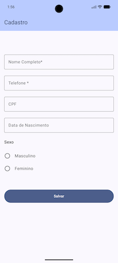

# Desafio Técnico - QA Engineer

## Objetivo

Este desafio tem como objetivo avaliar competências relacionadas a:

* Análise de requisitos
* Planejamento de testes
* Criação de cenários de teste
* Escrita de cenários BDD
* Testes exploratórios
* Identificação de riscos
* Estratégia de automação
* Comunicação e documentação

O foco principal não é encontrar defeitos específicos, mas compreender como você aborda a qualidade de um produto de software.

---

# Aplicação

O projeto consiste em um aplicativo Android simples contendo um formulário de cadastro.

O formulário possui campos obrigatórios, opcionais e validações básicas



---

# Funcionalidades

## Campos disponíveis

| Campo              | Obrigatório        |
| ------------------ | ------------------ |
| Nome               | Sim                |
| Telefone           | Sim                |
| CPF                | Não                |
| Data de Nascimento | Não                |
| Sexo               | Não                |

---

## Máscaras

### Telefone

Formato:

```text
(99) 99999-9999
```

### CPF

Formato:

```text
999.999.999-99
```

### Data de Nascimento

Formato:

```text
99/99/9999
```

---

## Salvamento

### Sucesso

Quando os campos obrigatórios estiverem preenchidos:

```text
Salvo com sucesso
```

### Erro

Quando algum campo obrigatório não estiver preenchido:

```text
Ops, algo deu errado
```

---

# Mapa de Componentes

Os seguintes identificadores (testTags) estão disponíveis para automação:

| Componente               | ID                      |
| ------------------------ | ----------------------- |
| Campo Nome               | input_name              |
| Campo Telefone           | input_phone             |
| Campo CPF                | input_cpf               |
| Campo Data de Nascimento | input_birthdate         |
| Sexo Masculino           | gender_option_masculino |
| Sexo Feminino            | gender_option_feminino  |
| Botão Salvar             | button_save             |
| Modal de confirmação     | dialog_confirmation     |
| Botão OK do modal        | dialog_button_ok        |

---

# História de Usuário

Como usuário,

Quero preencher um formulário de cadastro,

Para registrar minhas informações pessoais no aplicativo.

---

# Cenários BDD de Referência

## Cadastro realizado com sucesso

```gherkin
Feature: Cadastro de usuário

Scenario: Salvar formulário com campos obrigatórios preenchidos

Given que o usuário abriu o aplicativo
And informou um nome válido
And informou um telefone válido
When clicar no botão Salvar
Then o sistema deve exibir a mensagem "Salvo com sucesso"
```

---

## Tentativa de cadastro sem nome

```gherkin
Feature: Validação do formulário

Scenario: Salvar sem informar o nome

Given que o usuário abriu o aplicativo
And informou apenas o telefone
When clicar no botão Salvar
Then o sistema deve exibir a mensagem "Ops, algo deu errado"
```

---

## Tentativa de cadastro sem telefone

```gherkin
Feature: Validação do formulário

Scenario: Salvar sem informar o telefone

Given que o usuário abriu o aplicativo
And informou apenas o nome
When clicar no botão Salvar
Then o sistema deve exibir a mensagem "Ops, algo deu errado"
```

---

# O que esperamos que você faça

1. Analise os requisitos disponíveis.
2. Elabore casos de teste.
3. Identifique cenários positivos e negativos.
4. Identifique cenários de borda.
5. Crie cenários BDD adicionais.
6. Registre dúvidas ou inconsistências encontradas.
7. Documente riscos percebidos.
8. Descreva uma estratégia de automação.

---

# Automação

Para demonstrar conhecimentos em automação, você pode utilizar a ferramenta de sua preferência, por exemplo:

* Espresso
* Maestro
* Appium
* UI Automator
* Selenium (caso adapte para execução mobile)
* Outra ferramenta equivalente

---

# Avaliação

Serão considerados principalmente:

* Capacidade analítica
* Cobertura dos cenários
* Pensamento crítico
* Clareza da comunicação
* Capacidade de identificar riscos
* Qualidade da estratégia de testes

A quantidade de casos de teste não é mais importante do que a qualidade deles.

---

# Observação

Os requisitos apresentados representam uma visão simplificada de um produto real.

Caso encontre ambiguidades, comportamentos não especificados ou oportunidades de melhoria, registre suas observações e assuma premissas quando necessário.

Boas análises costumam levantar perguntas antes mesmo da execução dos testes.

Boa sorte!
